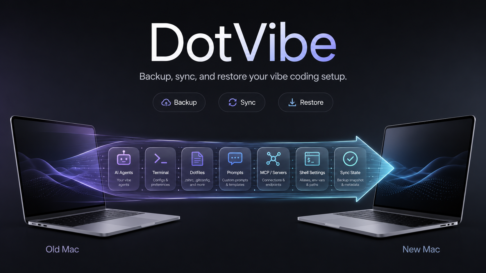

<p align="center">
  
  
  
  
</p>

<h1 align="center">dotvibe</h1>

<p align="center">
  
</p>

<p align="center">
  <b>Migrate your vibe coding setup to a new Mac.</b>
</p>

<p align="center">
  <b>English</b> &middot;
  <a href="README.zh.md">中文</a> &middot;
  <a href="https://github.com/yangyifan18/dotvibe/blob/main/LICENSE">License</a>
</p>

---

## Why dotvibe?

You spent weeks tuning your AI coding agents — custom memory, project-specific rules, hand-crafted skills, conversation history. Then you get a new Mac and realize:

- **Claude Code**'s project memory (`~/.claude/projects/`) is gone
- **Codex CLI**'s custom agents (`~/.codex/agents/`) are gone
- **OpenCode**'s configs (`~/.config/opencode/`) are gone
- All those carefully written `MEMORY.md`, `AGENTS.md`, `CLAUDE.md` files — vanished

macOS Migration Assistant transfers apps and settings, but not the nuanced per-project data your vibe coding workflow depends on. General dotfile managers (chezmoi, stow) don't understand these tools' internal structure.

**dotvibe** does.

| Feature | Description |
|---|---|
| `status` | Detect all vibe coding tools on your machine |
| `export` | Backup config + memory + skills into a single `.tar.gz` |
| `list` | Inspect what's inside a backup |
| `diff` | Compare two backups by manifest path, checksum, tool, or category |
| `setup` | Bootstrap supported agent CLIs on a new Mac, then optionally restore |
| `import` | Restore selectively — by tool, by project, or everything |

**Supported tools:** Claude Code &middot; Codex CLI &middot; OpenCode

## Install

```bash
# Go install
go install github.com/yangyifan18/dotvibe@latest

# Homebrew
# Coming soon: brew install yangyifan18/tap/dotvibe

# Build from source
git clone https://github.com/yangyifan18/dotvibe.git
cd dotvibe && go build -o dotvibe .
```

## Quick Start

### For Humans

```bash
# 1. See what you've got
dotvibe status

# 2. Back it up (auth and symlinks excluded by default)
dotvibe export

# 3. Send the .tar.gz to your new Mac (AirDrop, scp, whatever)

# 4. On the new machine
dotvibe import dotvibe-2026-05-20.tar.gz
```

### For Agents

```bash
# Agent-friendly: non-interactive, filtered restore
dotvibe import backup.tar.gz --yes --only claude-code

# Restore a specific project's memory
dotvibe import backup.tar.gz --dry-run --project "~/Code/MyProject"
dotvibe import backup.tar.gz --yes --project "~/Code/MyProject"

# Exclude patterns during export
dotvibe export --exclude "*/Research/*" --exclude "transcripts/*.jsonl"

# Overwrite an existing backup intentionally
dotvibe export -o backup.tar.gz --force

# Create a full backup
dotvibe export -o dotvibe-full.tar.gz

# Create an incremental backup against a previous archive
dotvibe export --base dotvibe-full.tar.gz -o dotvibe-delta.tar.gz

# Restore an incremental backup chain
dotvibe import dotvibe-delta.tar.gz --base dotvibe-full.tar.gz --yes

# Compare two backups
dotvibe diff old.tar.gz new.tar.gz

# Show Claude Code memory changes between two backups
dotvibe diff --only claude-code --category memory old.tar.gz new.tar.gz

# Produce JSON for automation
dotvibe diff --json old.tar.gz new.tar.gz

# Include session history (excluded by default)
dotvibe export --with-history
```

## What Gets Backed Up

| Category | Included | Examples |
|---|---|---|
| **Config** | Yes | `settings.json`, `config.toml`, `AGENTS.md` |
| **Memory** | Yes | `MEMORY.md`, project rules, per-project memory |
| **Skills** | Yes | Custom skills, plugins, agent definitions |
| **Auth** | No | `auth.json`, API keys, tokens |
| **History** | Opt-in | Sessions, transcripts (`--with-history`) |
| **Cache** | No | Telemetry, cache, temp files |
| **Symlinks** | No | Skipped to avoid unsafe cross-machine links |

## Setup Safety

`dotvibe setup` is dry-run by default. It prints detected tools and install commands. Use `--install` to run safe package-manager commands after confirmation. Commands marked as manual-review are shown but not run automatically.

```bash
# Preview detected tools, install commands, and optional restore plan
dotvibe setup backup.tar.gz

# Run safe install commands non-interactively, then restore
dotvibe setup backup.tar.gz --install --yes
```

## Restore Safety

`import` writes into the target machine's agent config directories. Preview first when possible; the preview lists each file, target path, and whether it will write, skip, or overwrite:

```bash
dotvibe import backup.tar.gz --dry-run
dotvibe import backup.tar.gz --dry-run --project "~/Code/MyProject"
```

For end-to-end tests, use a temporary HOME instead of your real profile:

```bash
HOME=/tmp/dotvibe-restore ./dotvibe import backup.tar.gz --yes
```

Project filtering currently applies to Claude Code project memory. Codex CLI and OpenCode are restored at tool level. New backups include per-file SHA-256 checksums; `list`, `diff`, and `import` reject corrupted archives when checksums are present.

## Documentation

- [Obsidian Docs](obsidian-docs/) — Project memory, risks, decisions
- Release builds — `VERSION=0.1.0 ./scripts/build-release.sh`

---

## Star History

[](https://star-history.com/#yangyifan18/dotvibe&Date)

## License

[MIT](LICENSE)
