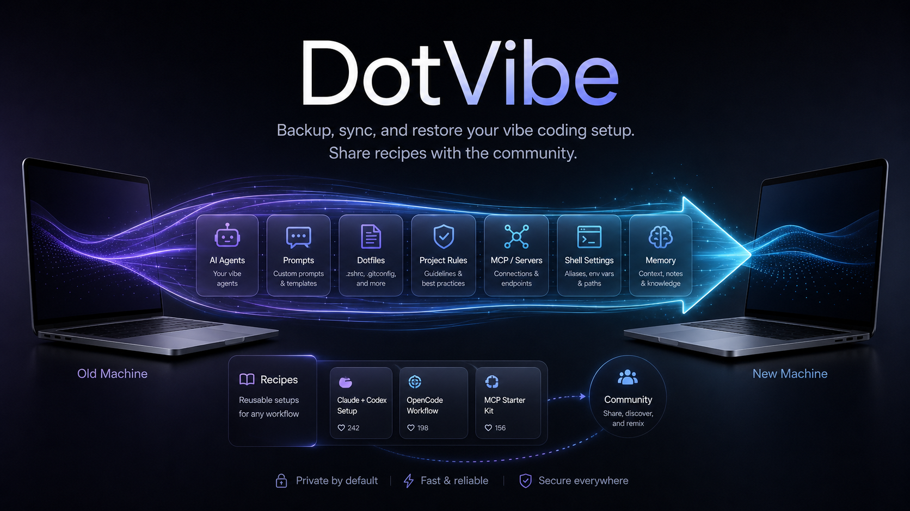

<p align="center">
  
  
  
  
</p>

<h1 align="center">dotvibe</h1>

<p align="center">
  
</p>

<p align="center">
  <b>Move, inspect, and share your AI coding context across machines and environments.</b>
  <br/>
  DotVibe understands AI coding agents — their memories, skills, prompts, project rules, and configs — not just dotfiles.
</p>

<p align="center">
  <b>English</b> &middot;
  <a href="README.zh.md">中文</a> &middot;
  <a href="https://github.com/yangyifan18/dotvibe/blob/main/LICENSE">License</a>
</p>

---

## Why dotvibe?

You spent weeks tuning your AI coding agents — custom memory, project-specific rules, hand-crafted skills, conversation history. Then you open a fresh machine, work laptop, or rebuilt development environment and realize:

- **Claude Code**'s project memory (`~/.claude/projects/`) is gone
- **Codex CLI**'s custom agents (`~/.codex/agents/`) are gone
- **OpenCode**'s configs (`~/.config/opencode/`) are gone
- All those carefully written `MEMORY.md`, `AGENTS.md`, `CLAUDE.md` files — vanished

**dotvibe** does.

## How is this different from macOS Migration Assistant?

macOS Migration Assistant is great when you want to copy an entire Mac to another Mac. dotvibe is narrower and more agent-native: it focuses on AI coding context, lets you inspect what will move, selectively import tools or projects, handle changed usernames/project paths, stage and merge project memory, and export shareable `.vibe` recipes without private transcripts or project data.

If you already used full-device migration and everything works, you may not need dotvibe for that machine. dotvibe is most useful for fresh setups, partial migrations, team recipes, remote/dev environments, backups, diffs, and controlled restore flows.

## DotVibe vs dotfile managers

| Feature | DotVibe | Mackup / chezmoi |
|---|---|---|
| Knows Claude Code project memory | Yes | No / manual |
| Knows Codex agents | Yes | Manual paths |
| Knows OpenCode config layout | Yes | Manual paths |
| Selective restore by tool/project | Yes | Limited/manual |
| Auth excluded by default | Yes | Depends on config |
| Backup diff by agent/category | Yes | Generic file diff |
| Fresh machine bootstrap | Yes | Partial/manual |

| Feature | Description |
|---|---|
| `status` | Detect all vibe coding tools on your machine |
| `export` | Backup config + memory + skills into a single `.tar.gz` |
| `list` | Inspect what's inside a backup |
| `diff` | Compare two backups by manifest path, checksum, tool, or category |
| `setup` | Bootstrap supported agent CLIs on a new machine/environment, then optionally restore |
| `import` | Restore selectively — by tool, by project, or everything |
| `recipe export` | Create a shareable `.vibe` recipe with skills, agents, global rules, and safe settings |
| `recipe apply` | Apply a `.vibe` recipe without needing a full backup |

**Supported tools:** Claude Code &middot; Codex CLI &middot; OpenCode

## Install

```bash
# Go install
go install github.com/yangyifan18/dotvibe@latest

# Homebrew
# Runbook: docs/homebrew-preflight.md
# Maintainers: validate locally before publishing the tap
# ./scripts/homebrew-preflight.sh --keep
# Coming soon: brew install yangyifan18/tap/dotvibe

# Build from source
git clone https://github.com/yangyifan18/dotvibe.git
cd dotvibe && go build -o dotvibe .
```

## Quick Start

### For Humans

```bash
# 1. See what you've got
dotvibe status

# 2. Back it up (auth and symlinks excluded by default)
dotvibe export

# 3. Send the .tar.gz to your new machine/environment (AirDrop, scp, whatever)

# 4. On the new machine
dotvibe import dotvibe-2026-05-20.tar.gz
```

### For Agents

```bash
# Agent-friendly: non-interactive, filtered restore
dotvibe import backup.tar.gz --yes --only claude-code

# Restore a specific project's memory
dotvibe import backup.tar.gz --dry-run --project "~/Code/MyProject"
dotvibe import backup.tar.gz --yes --project "~/Code/MyProject"

# Exclude patterns during export
dotvibe export --exclude "*/Research/*" --exclude "transcripts/*.jsonl"

# Overwrite an existing backup intentionally
dotvibe export -o backup.tar.gz --force

# Create a full backup
dotvibe export -o dotvibe-full.tar.gz

# Create an incremental backup against a previous archive
dotvibe export --base dotvibe-full.tar.gz -o dotvibe-delta.tar.gz

# Restore an incremental backup chain
dotvibe import dotvibe-delta.tar.gz --base dotvibe-full.tar.gz --yes

# Compare two backups
dotvibe diff old.tar.gz new.tar.gz

# Show Claude Code memory changes between two backups
dotvibe diff --only claude-code --category memory old.tar.gz new.tar.gz

# Produce JSON for automation
dotvibe diff --json old.tar.gz new.tar.gz

# Include session history (excluded by default)
dotvibe export --with-history
```

## Agent-Assisted Migration

DotVibe is designed to be driven by an agent. Instead of memorizing every command, install the Codex skill from `agent/codex/dotvibe-migration/` and ask:

```bash
CODEX_HOME="${CODEX_HOME:-$HOME/.codex}"
mkdir -p "$CODEX_HOME/skills/dotvibe-migration"
cp -R agent/codex/dotvibe-migration/. "$CODEX_HOME/skills/dotvibe-migration/"
```

Restart Codex or reload skills, then ask:

```text
Use dotvibe to export my memories.
```

The agent uses `dotvibe agent doctor --json`, `dotvibe agent inventory --json`, export/import plans, dry-runs, and staging workspaces to guide you through choices. For project memory conflicts, the agent stages archive and local files first so you can review or merge before anything is written to real tool directories.

For project memory, agent-assisted import understands changed usernames and home paths across machines. A backup from `/Users/young/Softwares/dotvibe` can be planned for `/Users/youtopia/Softwares/dotvibe` by replacing the old home prefix with the new home. If the project is missing on the new machine, the agent can show a sanitized `git clone` command from backup metadata and ask before running it. If a project already exists, the agent asks before loading old memory and stages conflicts for review.

## Vibe Recipes

Recipes are for sharing a setup with teammates or the community. They strip personal data and keep only shareable items such as Claude Code skills, Codex agents, global rules, and safe settings.

```bash
# Export a recipe
dotvibe recipe export --name "YYF Vibe Stack" --author "yangyifan" -o yyf.vibe

# Inspect and lint before sharing or applying
dotvibe recipe inspect yyf.vibe
dotvibe recipe lint yyf.vibe --strict

# Compare two recipes
dotvibe recipe diff old.vibe new.vibe
dotvibe recipe diff old.vibe new.vibe --content

# Apply safely with lint + conflict handling
dotvibe recipe apply yyf.vibe --dry-run
dotvibe recipe apply yyf.vibe

# Non-interactive modes
dotvibe recipe apply yyf.vibe --yes              # skip conflicts
dotvibe recipe apply yyf.vibe --force --yes      # overwrite conflicts
dotvibe recipe apply yyf.vibe --allow-risk       # continue despite lint errors

# Roll back a recipe apply transaction
dotvibe rollback list
dotvibe rollback 20260521-143012-a1b2c3
dotvibe rollback 20260521-143012-a1b2c3 --path ~/.codex/agents/reviewer.md
dotvibe rollback prune --keep 20 --dry-run
```

Recipes do not include Claude project memory, transcripts, Codex sessions, auth files, telemetry, or cache data. `recipe apply` runs lint first and stores rollback records for writes and overwrites. The top-level `dotvibe apply` command remains as a deprecated compatibility alias.

## What Gets Backed Up

| Category | Included | Examples |
|---|---|---|
| **Config** | Yes | `settings.json`, `config.toml`, `AGENTS.md` |
| **Memory** | Yes | `MEMORY.md`, project rules, per-project memory |
| **Skills** | Yes | Custom skills, plugins, agent definitions |
| **Auth** | No | `auth.json`, API keys, tokens |
| **History** | Opt-in | Sessions, transcripts (`--with-history`) |
| **Cache** | No | Telemetry, cache, temp files |
| **Symlinks** | No | Skipped to avoid unsafe cross-machine links |

## Setup Safety

`dotvibe setup` is dry-run by default. It prints detected tools and install commands. Use `--install` to run safe package-manager commands after confirmation. Commands marked as manual-review are shown but not run automatically.

```bash
# Preview detected tools, install commands, and optional restore plan
dotvibe setup backup.tar.gz

# Run safe install commands non-interactively, then restore
dotvibe setup backup.tar.gz --install --yes
```

## Restore Safety

`import` writes into the target machine's agent config directories. Preview first when possible; the preview lists each file, target path, and whether it will write, skip, or overwrite:

```bash
dotvibe import backup.tar.gz --dry-run
dotvibe import backup.tar.gz --dry-run --project "~/Code/MyProject"
```

For end-to-end tests, use a temporary HOME instead of your real profile:

```bash
HOME=/tmp/dotvibe-restore ./dotvibe import backup.tar.gz --yes
```

Project filtering currently applies to Claude Code project memory. Codex CLI and OpenCode are restored at tool level. New backups include per-file SHA-256 checksums; `list`, `diff`, and `import` reject corrupted archives when checksums are present.

## Documentation

- [Obsidian Docs](obsidian-docs/) — Project memory, risks, decisions
- Release builds — `VERSION=1.1 ./scripts/build-release.sh`

---

## Star History

[](https://star-history.com/#yangyifan18/dotvibe&Date)

## License

[MIT](LICENSE)
